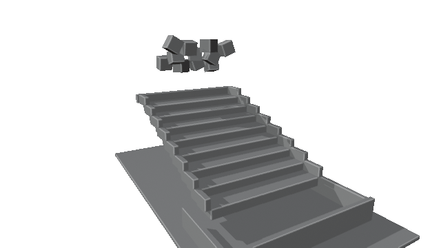

# NemoClaw Specialized Agents for Blender and Omniverse

This project creates a specialized NemoClaw Hermes agent for Blender and
NVIDIA Omniverse workflows on DGX Station. A local Nemotron 3 Ultra model plans
the work, Blender MCP provides live control of the desktop application, and the
NVIDIA OVRTX/OVPhysX libraries perform rendering and native physics.

The specialized agent can be used in either of two ways:

- **NemoClaw entry point:** ask Hermes directly for Blender, OVRTX, or OVPhysX
  work. This is the shortest path for a focused scene task.
- **Codex entry point:** ask Codex to coordinate a broader task. Codex delegates
  Blender and Omniverse execution to the specialized Hermes agent, then checks
  its receipts and host artifacts. This is useful when the work also includes
  repository changes, debugging, analysis, or documentation.

Both paths route specialized execution through the same Hermes agent, local
Nemotron model, OpenShell sandbox, OV skills, Blender MCP connection, visible
Blender process, and native OV runtimes. The Codex path additionally uses the
OpenAI model configured by Codex for general planning and repository work.
Codex is an optional general intelligence layer, not a replacement for the
specialized agent.

Together they can:

- inspect and modify the Blender scene visible on the user's desktop;
- render scene outputs with OVRTX;
- run native OVPhysX simulations with authoritative pose readback;
- replay simulation poses in Blender and create visual evidence such as GIFs;
- report host artifact paths and distinguish native simulation from Blender
  replay rendering.
- route complex handoff work through bounded typed MCP operations that return
  host-side sizes and SHA-256 receipts instead of relying on unverified agent
  narratives.

The setup and demo are validated on NVIDIA DGX Station with Ubuntu 24.04 ARM64,
a GB300 for local inference, and an RTX PRO 6000 Blackwell GPU for OVRTX.

## Example

Send this prompt directly to Hermes:

```text
Run the configured native OVPhysX stair-drop demo. Create a GIF of the blocks
falling down the stairs and report the native simulation status and host GIF
path.
```

Hermes invokes the host helper through Blender MCP, runs native OVPhysX, reads
back 25 authoritative samples for 12 bodies, and renders a Blender replay:



The validated receipt reports:

```text
native_status: pass-real
physics_source: native-ovphysx-readback
render_class: blender-replay
sample_count: 25
```

## Entry Points

Test NemoClaw directly with a focused task:

```bash
nemohermes ov-blender-hermes exec --timeout 1200 -- \
  hermes chat -Q --max-turns 30 -q \
  "Render the current scene as a beauty shot with OVRTX. Preserve the scene and report the host PNG path."
```

Or ask Codex to coach Hermes through an example task:

```text
Use $coach-nemoclaw-hermes. Coach Hermes through this task: render the current
Blender scene as an OVRTX beauty shot. Delegate the Blender and OVRTX work to
Hermes, avoid overlapping Hermes runs, allow it enough time to finish, and
verify the resulting host PNG. Do not control Blender directly unless I
authorize fallback execution.
```

The [primary DGX Station setup guide](docs/setup-dgx-station-arm64.md) installs
the NemoClaw-first path. After that works, the
[supplementary Codex setup guide](docs/setup-codex-entrypoint.md) installs Codex
CLI, the Hermes coaching skill, and the upstream OV add-on skills for Codex.

## Architecture

```text
            Entry point
         /               \
 Codex generalist      Hermes directly
         \               /
        NemoClaw Hermes specialist
       local Nemotron 3 Ultra (vLLM)
             OpenShell sandbox
                    |
          specialized OV skills
                    |
        approved Blender MCP policy
          /                 \
 live Blender MCP      typed workflow MCP
                            |
                   bounded host receipts
          \                 /
       visible host Blender on RTX PRO
              |                 |
            OVRTX             OVPhysX
          rendering       native simulation
```

The OpenShell sandbox contains Hermes and its skills. Blender, the OV add-on,
native runtime libraries, fixture data, and outputs remain on the host. The
policy permits Hermes to reach only the host Blender MCP proxy needed by this
workflow and a bounded workflow proxy for inventory, USD export/inspection,
and artifact verification. An always-on SOUL block makes the host boundary
explicit, and a searchable copy of the official Blender 5.1 Python API helps
Hermes verify version-specific properties and operators against the running
Blender process before mutation. A `blenderraw` profile owns exploratory raw
Blender MCP access and is selected as Hermes' sticky default, so the normal TUI
and machine dashboard use it without changing the integrity-protected base
configuration. An isolated `blenderhandoff` profile disables terminal and file
tools for bounded handoff tasks and remains explicitly selected through its
wrapper. In the Codex path, Codex invokes Hermes through `nemohermes ... exec`
or `openshell sandbox exec`. By default it does not bypass Hermes to operate
Blender directly; the coaching skill requires explicit user authorization for
fallback execution.

## Prerequisites

- NVIDIA DGX Station running Ubuntu 24.04 ARM64.
- NVIDIA GB300 with enough coherent memory for Nemotron 3 Ultra.
- RTX-capable GPU; validation uses RTX PRO 6000 Blackwell.
- Blender 5.1.x for Linux ARM64.
- The official NVIDIA Omniverse Labs
  [`ov-blender-example`](https://github.com/NVIDIA-Omniverse/omniverse-labs/tree/main/projects/ov-blender-example)
  add-on, OVRTX runtime, OVPhysX runtime, and upstream skills from its
  [public releases](https://github.com/NVIDIA-Omniverse/omniverse-labs/releases).
- vLLM serving
  `nvidia/NVIDIA-Nemotron-3-Ultra-550B-A55B-NVFP4` locally.
- NemoClaw with the Hermes agent and OpenShell sandbox runtime.
- Docker with NVIDIA Container Toolkit, FFmpeg, and NoMachine.
- A Hugging Face read token for the model. The OV project and release assets
  are public and do not require GitHub authentication.

See the complete [DGX Station ARM64 setup guide](docs/setup-dgx-station-arm64.md)
for commands, validation checks, temporary patches, troubleshooting, and the
exact tested component matrix.

## Repository Structure

| Path | Purpose |
| --- | --- |
| [`docs/setup-dgx-station-arm64.md`](docs/setup-dgx-station-arm64.md) | End-to-end installation and validation guide |
| [`docs/setup-codex-entrypoint.md`](docs/setup-codex-entrypoint.md) | Optional Codex CLI entry-point setup after the primary guide |
| [`skills/`](skills/) | Additive Hermes skills for the host boundary and Blender API verification |
| [`hermes/`](hermes/) | Always-on SOUL guidance for Blender's host/sandbox execution boundary |
| [`codex-skills/`](codex-skills/) | Codex coaching skills for delegating OV work to Hermes |
| [`policies/`](policies/) | OpenShell network policies for Blender MCP and optional fixture access |
| [`prompts/`](prompts/) | Render and physics prompts for CLI or dashboard use |
| [`scripts/`](scripts/) | Blender install, OV runtime materialization, vLLM launch, bounded MCP workflow, verification, and OVPhysX host helpers |
| [`docs/blender-sandbox-evaluation.md`](docs/blender-sandbox-evaluation.md) | Tiered evaluation method and evidence for host/sandbox routing |
| [`patches/`](patches/) | Explicit temporary compatibility patches for ARM64 setup |
| [`docs/assets/`](docs/assets/) | Validated demo output used by project documentation |

## Project Boundary

This repository extends the upstream OV Blender example additively. It does not
fork or replace OVRTX, OVPhysX, their Blender add-on, or the public OV skills.
The local additions are limited to installation orchestration, the explicit
OpenShell policy, always-on host boundary guidance, version-pinned Blender API
reference search, a Codex-to-Hermes coaching skill, and generic helpers for
native pose sampling and Blender replay.

Temporary compatibility patches are identified in the setup guide so they can
be removed as ARM64 support lands upstream.

## Start

Follow the [primary setup guide](docs/setup-dgx-station-arm64.md). To add Codex
as an entry point, continue with the
[Codex setup guide](docs/setup-codex-entrypoint.md). Human-readable tasks for
either entry point are available in
[`prompts/demo-prompts.md`](prompts/demo-prompts.md).
